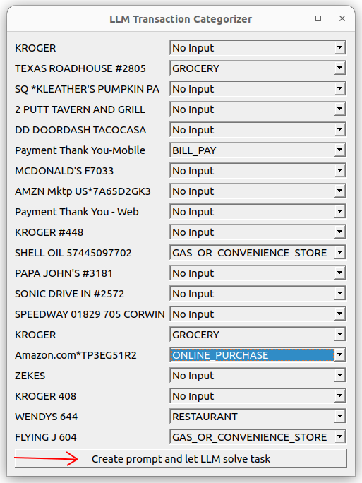

# Credit Card Statement Categorizer using AI (private, no cloud)
* A local (no internet required) Large Language Model (LLM) 
performs the task of reading credit card transaction descriptions (messy text) 
and assigning the best category out of a list you give it.

# Why 
* Showcase an advanced NLP use case of LLMs with no subscriptions or privacy concerns like one might have when through a third party cloud api.
* To show an example of how to setup a local LLM comparable to GPT3. 
* Demonstrate prompt engineering an LLM (and sanitizing the output) to do your bidding. Uses a GUI to create a useful prompt.
* Give an example of rapid prototyping something to get an idea if it is worth polishing.

# How it works
* Optionally enter some examples via the GUI window and click the button. A custom
prompt will be created and sent to the LLM.
* 
* Timing data and debug info is printed to the console as the spreadsheet file is processed line by line.
* It outputs a new **results.csv** spreadsheet with a column "Category_LLM" containing the category selected by the LLM.
  
# Caveats
* This is a prototype to display the technique, nothing more and not production code.

# Install 💥
* Download the mistral-7b or similar LLM model file **(Google: "mistral-7b-instruct-v0.2.Q4_K_M.gguf huggingface")** from huggingface and put it in its own directory.
* Change the folder `/home/bb/llms` in main.py to point to your model file. (mistral-7b recommended, but others work!)
* ```python3.10 -m venv myenv``` # create virtual environment
* ```source myenv/bin/activate``` # activate virtual environment
* Install python package *llama-cpp-python* with or without cuda support 
* To install with cuda: `FORCE_CMAKE=1 CMAKE_ARGS="-DLLAMA_CUBLAS=on" pip install llama-cpp-python`
* If you want to use CPU only, (10-30x slower per answer, but still delivers the point) just skip the line above.
* Install the other dependencies:
* ```pip install -r requirements.txt```
* Run with  `python main.py`

# Help me out!
* If you found this helpful and got to understand LLMs prototyping a bit better, I would be extremely glad if you could give it a star! :star:
